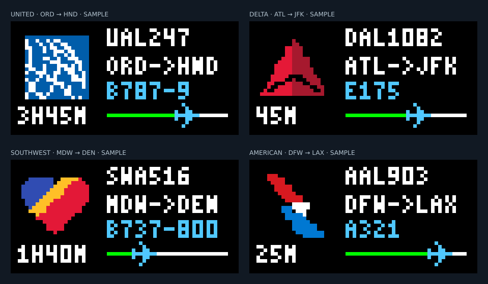
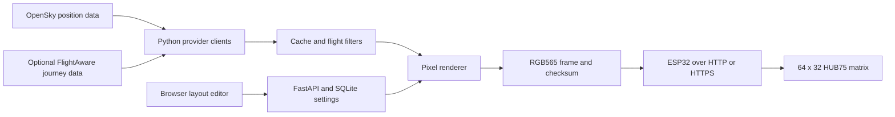

# Flightdeck Studio

**An ESP32 flight-information display with a Python service and a browser-based layout editor.**

Flightdeck connects flight-data clients, a cache and filtering layer, a shared pixel renderer, and ESP32 firmware for a **64 × 32 HUB75 RGB matrix**. Sample mode lets the service, editor, and device protocol run without a paid API account or physical panel.

[Setup and operation](USAGE.md) · [Hardware](docs/firmware.md) · [Wire protocol](docs/protocol.md) · [Validation](docs/validation.md)



*Software-rendered sample layouts. Physical panel output is not verified by this image.*

## System architecture



The backend performs flight matching and rendering; the ESP32 receives complete pixel frames rather than parsing airline APIs. The browser and Python renderer share font/layout resources and are checked for matching RGB565 output.

## Engineering features

| Area | Implemented behavior |
| --- | --- |
| Flight service | Async provider access, flight filtering, token renewal, bounded caching, stale-data behavior, retry/cooldown handling |
| Layout editor | Movable and independently toggleable layers, logo import, presets, clipping checks, JSON import/export |
| Journey information | Optional route, aircraft, ETA, and estimated time-progress enrichment; unavailable data stays unknown |
| Device interface | Authenticated frame delivery, length/checksum validation, layout revision acknowledgement, simulator |
| Persistence | SQLite settings and optimistic revision checks |
| Delivery | Docker/Compose definitions, optional Render configuration, software/firmware CI definitions |

The default layout uses a 20 × 20 airline logo with a flight identifier, route, aircraft type, time remaining, and a progress bar. Sample routes are illustrative, not live flight information.

## Run locally without flight-provider credentials

Requires Python 3.12 or newer. From this directory:

```bash
python -m venv .venv
# macOS / Linux:
source .venv/bin/activate
# Windows PowerShell instead:
# .venv\Scripts\Activate.ps1
python -m pip install -r requirements.txt
python scripts/setup_env.py
python -m backend
```

Open `http://localhost:8000`. Choose **Connect service**, enter the local service URL, and use the generated `ADMIN_TOKEN` from `.env`. The setup script refuses to overwrite an existing environment file. Keep the default sample provider for the first run.

For live data, configure server-side provider credentials using [USAGE.md](USAGE.md). Optional FlightAware requests may be billable; inspect request caps before enabling them. Do not paste credentials into the browser source or commit `.env`.

## Hardware integration

The firmware targets a single 64 × 32, 1/16-scan HUB75 panel, with generic ESP32 and ESP32-S3 build profiles. **A generic profile is not a verified pinout for every matrix controller.** Confirm the exact board schematic, panel scan pattern, power requirements, and GPIO mapping before connecting or flashing hardware.

See [firmware setup](docs/firmware.md). The service/device contract is documented separately in [protocol.md](docs/protocol.md). A software-only device check is available through `scripts/simulate_device.py`.

## Tests

```bash
python -m pip install -r requirements-dev.txt
python -m pytest -q
node --test tests/editor.test.mjs
```

Node.js 22+ and a native C++ compiler are needed for the cross-language checks. PlatformIO firmware commands are in the operating guide. Test definitions and CI configuration are not the same as completed CI or hardware validation: see the dated [validation record](docs/validation.md) for exactly what was run.

## Repository map

```text
backend/       Python API, provider clients, cache, filtering, persistence, renderer
firmware/      ESP32 / ESP32-S3 code and frame decoder
dist/          Working browser editor and required shared pixel assets
docs/          Protocol, hardware, assets, and validation records
scripts/       Environment setup, device simulator, safe source packaging
tests/         Python, JavaScript, protocol, and renderer checks
```

`dist/` contains required application assets and must stay in the repository. Only the generated source ZIP inside it is ignored.

## Status and limitations

Software tests can validate frame correctness and simulated service behavior; they do not establish physical Wi-Fi stability, wiring compatibility, scan performance, a successful cloud deployment, or real provider-account access. No FPS, power, latency, or completed-hardware measurements are claimed without a recorded test.

See [contributing](CONTRIBUTING.md) and [security](SECURITY.md). Airline pixel assets and their documented origin remain in [pixel-logos.md](docs/pixel-logos.md); no airline endorsement is implied. Licensing and third-party asset rights should be reviewed before broad redistribution.
