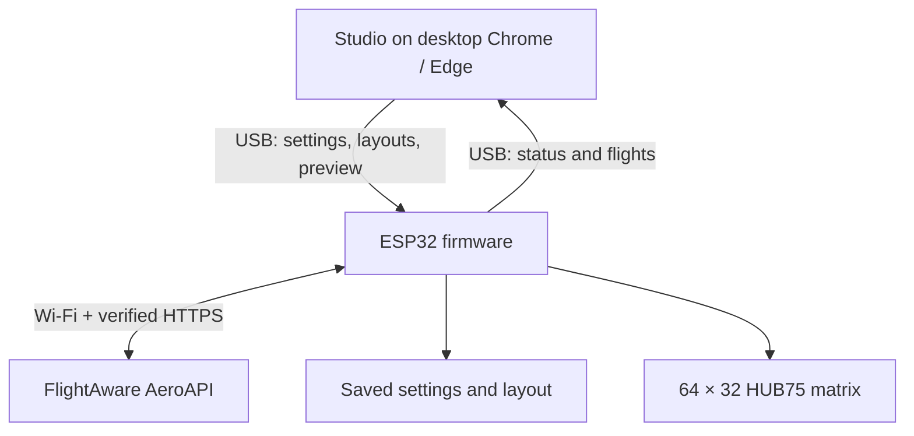

# Flightdeck Studio

**An autonomous ESP32 flight display, with a USB layout and setup studio.**

The ESP32 drives a 64 × 32 HUB75 matrix, joins Wi-Fi, talks directly to FlightAware AeroAPI over verified HTTPS, filters nearby flights, and renders its saved layout. Flightdeck Studio connects over USB to provision Wi-Fi/API credentials, edit layouts, mirror a live preview, and save layouts to the board. No Python flight-data service, Render deployment, or other always-on computer is required.

[Get started](USAGE.md) · [Hardware and flashing](docs/firmware.md) · [USB protocol](docs/protocol.md) · [Validation](docs/validation.md)

## Architecture



Studio is a static browser app. Its optional local launcher serves editor files only; it never queries FlightAware. Close Studio and disconnect the computer after setup: the externally powered board continues by itself.

## Start

1. Flash the updated firmware once: `pio run -d firmware -e esp32s3 -t upload`. This default profile retains the uploaded **Waveshare ESP32-S3 RGB Matrix N32R16** configuration. Confirm your board before choosing a different profile.
2. Close PlatformIO Serial Monitor. Run `python3 scripts/studio.py`, then open the printed localhost URL in desktop **Chrome or Edge**.
3. Click **Connect ESP32**, select its serial port, and enter your 2.4 GHz Wi-Fi settings. Choose **Offline demo** first, or provide an AeroAPI key and select **Live FlightAware**.
4. Enable **Live on matrix** to mirror your edits, including sample flights. Click **Save to ESP32** to keep the layout and filters in flash and resume autonomous display.

First-time serial access requires the browser's device picker. A single previously authorized matching USB port can reconnect automatically. Safari and Firefox do not provide the required Web Serial support; the UI explains this rather than pretending to connect.

## What runs on the board

- Direct AeroAPI nearby-airborne-flight search, geographic and flight filters, rotation, route/type display, and optional ETA enrichment.
- Shared 3 × 5 font, all 12 editor fields, layer visibility/position/scale, custom logos, metric/aviation units, RGB565 output.
- A separate Wi-Fi/TLS task so network waits do not block USB commands or rendering.
- Credential persistence in NVS; checksummed layout storage with a previous-copy fallback in LittleFS.
- A 4-second USB preview lease: the saved autonomous layout resumes when preview traffic stops.
- Bounded JSON/USB buffers, CRC-checked transfers, HTTPS trust roots, request caps, and Retry-After cooldowns.
- An offline demo with the PHL → ORD sample, a light-blue aircraft label and plane, and corrected United/Delta/Southwest palettes. The standalone sketch in `firmware/examples/offline-demo/main.cpp` uses the same generated logo data.

## Provider limits and credentials

AeroAPI needs your own account/key and may charge per result set. Defaults are **one poll every 300 seconds** and **at most 24 HTTP requests per UTC hour**, persisted across reboot. A poll uses one search plus at most one ETA request, both counted. This is a request guard, not a dollar spending limit. Check your account's pricing and endpoint access.

One page / at most 15 matching flights is retained. More results are reported as truncated; narrow the radius to reduce omissions. Search covers **airborne** flights. ETA is looked up for one rotating flight per poll and cached for ten minutes; other flights may show `--` until enriched. Vertical speed is unavailable from this endpoint and stays unknown. No data is fabricated when the provider fails. See [USAGE.md](USAGE.md) for all limits.

Wi-Fi passwords and API keys travel directly over the selected USB connection. They are never written to browser storage or returned in status replies. Device flash is **not encrypted** by this firmware; treat the physical board and the computer used to configure it as trusted.

## Development checks

Use separate Python environments for the legacy service tests and PlatformIO: their Uvicorn/Starlette dependencies are incompatible. Studio's launcher still needs only the Python standard library. Install firmware tools as described in [Hardware and flashing](docs/firmware.md#build-and-upload).

```bash
python3 -m venv .venv
source .venv/bin/activate
python -m pip install -r requirements-dev.txt
python -m pip check
python -m pytest -q
node --test tests/*.test.mjs
node scripts/generate_device_assets.mjs --check
firmware/.venv/bin/pio run -d firmware -e esp32dev -e esp32s3
python scripts/test_device_provider.py
```

On Windows, activate the test environment with `.venv\Scripts\activate` and use `firmware\.venv\Scripts\pio.exe` for firmware commands.

Native tests compare the actual C++ firmware renderer with Studio pixels and check malformed layouts using address/undefined-behavior sanitizers. USB and browser tests use simulated hardware. Neither compilation nor simulated tests establish physical panel or paid-account compatibility. See the [validation record](docs/validation.md).

## Repository

- `dist/`: Studio; required source assets despite the directory name.
- `firmware/`: autonomous firmware, pinned build profiles, saved hardware demo.
- `scripts/`: static Studio launcher, asset generation, source packaging, provider tests.
- `tests/`: existing service tests plus USB, native renderer, provider and browser checks.
- `backend/`, Docker/Render definitions: retained **legacy service implementation**; not used by current Studio or firmware. [Legacy reference](docs/legacy-service.md).

[Security](SECURITY.md) · [Contributing](CONTRIBUTING.md) · [Pixel asset attribution](docs/pixel-logos.md). No airline endorsement is implied.
