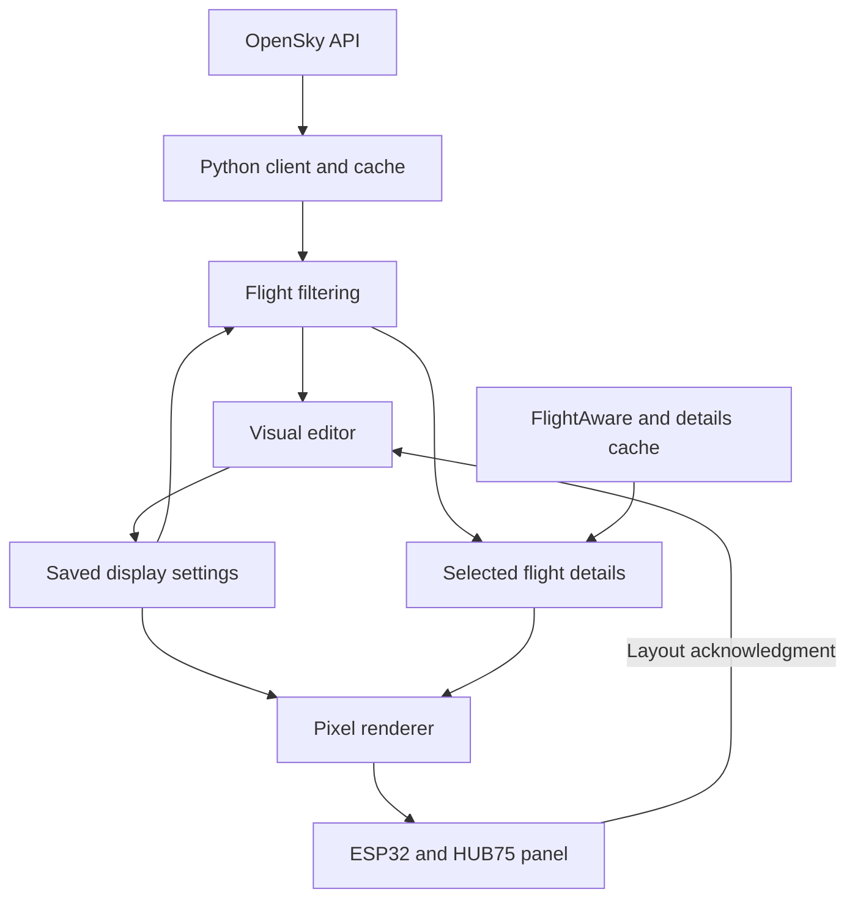

# Service and device protocol

All configuration, preview, and status routes require `Authorization: Bearer <ADMIN_TOKEN>`. The device endpoint accepts only the separate `DEVICE_TOKEN`. Tokens are never passed in query strings. Health and editor assets are readable without an API token; they contain no saved user configuration or credentials.

| Method | Path | Behavior |
| --- | --- | --- |
| GET | `/api/health` | Service liveness and selected provider |
| GET | `/api/config` | `{config, revision}` and revision `ETag` |
| PUT | `/api/config` | Validate and persist a config; requires `If-Match` revision |
| GET | `/api/flights` | Flights matching the saved filters |
| POST | `/api/preview` | Flights matching a draft config, without saving it |
| GET | `/api/status` | Cache counters, upstream counters, device acknowledgments |
| GET | `/api/device/frame` | Complete 64 × 32 RGB565 display frame |

Config writes without `If-Match` return 428. Conflicting revisions return 409. Invalid values return 422. Bodies over 128 KiB return 413. A successful HTTP flight response can have `status: unavailable`; always inspect the status and error fields. A failed upstream fetch never changes `source` from `opensky` to `demo`.

The flight query uses one or two geographic bounding boxes and then an exact great-circle distance check. Cached snapshots are keyed by source and geographic query. Further filters share that snapshot. One refresh runs at a time, even when the GUI and device request simultaneously. Failed refreshes can reuse a prior snapshot for at most `TTL + STALE_SECONDS`, and individual positions still expire at the configured position-age threshold. Cache and device presence are ephemeral; configuration is durable.

## Journey fields

`GET /api/flights` and `POST /api/preview` accept an optional `flight_id` query parameter (six lowercase hex characters). Only that flight, or the first match when absent/unavailable, is enriched with live journey data. The device endpoint enriches the flight selected by its rotation. These optional Flight properties are nullable:

| Field | Meaning |
| --- | --- |
| `departure_airport`, `arrival_airport` | 3–4 character airport identifiers; prefer IATA, then ICAO |
| `aircraft_type` | Compact type label, at most 24 characters |
| `departure_time` | Actual runway departure as UTC Unix seconds |
| `arrival_time` | Estimated runway arrival as UTC Unix seconds |
| `progress_percent` | Optional provider progress, 0–100; fallback when timing is incomplete |
| `details_source` | `sample`, `aeroapi`, or null |

The response includes `details_status`: `sample`, `fresh`, `cached`, `unknown`, `not_configured`, `not_requested`, or `unavailable`. An enrichment failure keeps the position snapshot usable and leaves new fields null. Details use a separate bounded cache, five-minute default TTL, no extended stale fallback, and a per-process hourly request cap. No API key is sent to the browser or ESP32. Service status includes lookup counters and configuration availability.

Configuration layers now accept `route`, `aircraft`, `eta`, and `progress`. The route uses a pixel-font `->` arrow; ETA is rounded up to minutes (`3H45M`, `45M`, or `--`). Progress is elapsed UTC time divided by estimated total time, clamped to 0–100%, with provider percentage as a fallback. The bar has green completed pixels, white remaining pixels, and a 7 × 7 plane in the layer's `color`; it requires at least 7 × 7 layer dimensions. Missing progress renders dashes instead of a 0% bar. The default logo layer is 20 × 20; bitmap source dimensions remain independent. Schema version and the FLT1 packet remain unchanged.

## FLT1 binary frame

The response is `application/octet-stream`, **4,118 bytes** total. The first 22 bytes form the header. All multi-byte integers, including pixels, are **little endian**.

| Offset | Bytes | Value |
| --- | --- | --- |
| 0 | 4 | ASCII `FLT1` |
| 4 | 2 | Width: 64 |
| 6 | 2 | Height: 32 |
| 8 | 1 | Brightness: 1–255 |
| 9 | 1 | Flags |
| 10 | 4 | Saved configuration revision |
| 14 | 4 | Pixel payload length: 4,096 |
| 18 | 4 | Standard CRC-32 of pixel payload |
| 22 | 4,096 | 2,048 row-major RGB565 pixels |

Flags: bit 0 = stale snapshot; bit 1 = no selected flight; bit 2 = upstream unavailable; bit 3 = sample source. Reserved bits must be zero. These flags may combine.

RGB565 has 5 red, 6 green, and 5 blue bits. The browser paints RGB888 colors; framebuffer parity tests compare the corresponding RGB565 bytes. Hardware brightness changes the panel driver; it does not darken exported pixel values.

The device requests a frame every five seconds. `X-Device-ID` is 1–40 letters, digits, underscores, or hyphens. `X-Frame-Ack` carries the last successfully displayed configuration revision; send 0 before the first successful display. This acknowledges a layout revision, not a unique flight frame. Seeing an online device proves recent polling; an acknowledged revision proves that revision reached the render loop, not that every physical LED worked.

Packets are verified for length, dimensions, reserved bits, and payload checksum before display. HTTP redirects are disabled to prevent the device token from following an unexpected redirect. After a connection failure, firmware backs off up to 30 seconds. It replaces a retained display with `SERVICE OFFLINE` after the offline interval; this check runs between bounded network calls.

Changes travel from the GUI through an authenticated configuration write. The ESP32 pulls the newest rendered frame. No inbound port, MQTT broker, or Python runtime is required on the ESP32.

## Data flow

The last edge represents status shown through the Python service. The browser does not directly contact the ESP32.
